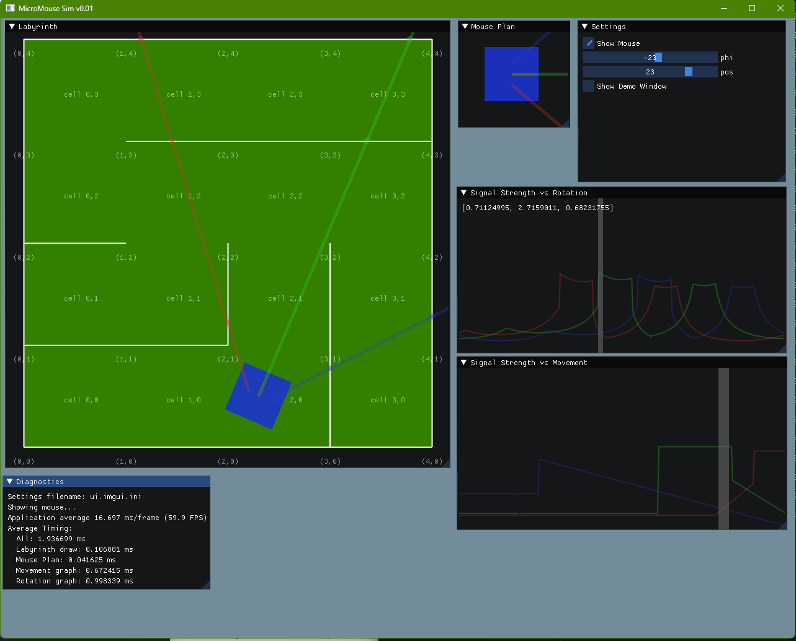

# MicroMouse Simulator

## Goal

The goal of this project is to create a somewhat realistic micromouse simulator that can be used to try out different ML
algorithms for micromouse-s.

## Inspiration

A peculiar process happens with human vision, due to object permanence our brains can reconstruct fully a scene even if
we observe only parts of it at one time, e.g. looking through blinds, a single narrow band is sufficient if we move our
head so that the full field can be scanned, one line at a time.

Micromouses generally have very slow CPUs, so full-blown live image recognition seems out of the capacity of the
low-power device.

Assuming a low-resolution detection method, e.g. three infrared proximity detectors, **in addition to the movement
around the maze**, it should be possible to figure out the layout of the maze.

## Screenshot

